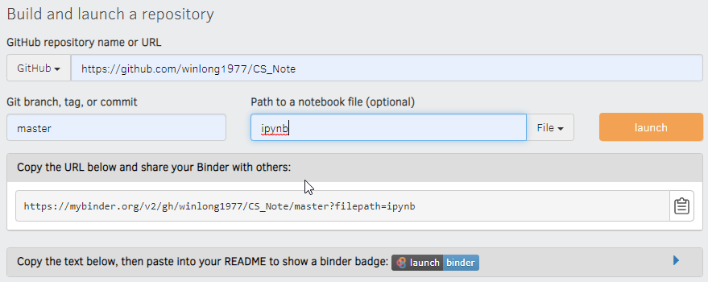

# Background
I just realized that you can create Jupyter/IPyhtonNotebook in [Google Colab](https://colab.research.google.com/notebooks/intro.ipynb) which can link to github.  Bravo.

## References
https://www.dataschool.io/cloud-services-for-jupyter-notebook/ lists out 6 cloud services for ipython.  Each solution has its pros and cons.  I am just going to write the pros and cons in my perspective for my own reference.

Provider       |     Pros            |   Cons
---------------|---------------------|------------------------
Binder         | Connect to github   |
Kaggle Kernels |
Google Colab   | Connect to GDrive |
Azure Notebook |
CoCalc         |
Datalore       |

## ipynb on binder
This is probably the most convenient way of creating ipynb on the cloud. (Better than Google colab).

https://hub.gke.mybinder.org/user/winlong1977-cs_note-ce1iodoq/tree/ipynb

## ipynb on github
github cannot render ipynb files dynamically, here are some links for ipynb on github

* https://docs.github.com/en/github/managing-files-in-a-repository/working-with-jupyter-notebook-files-on-github
* https://github.com/jupyter/notebook

# Introduction
